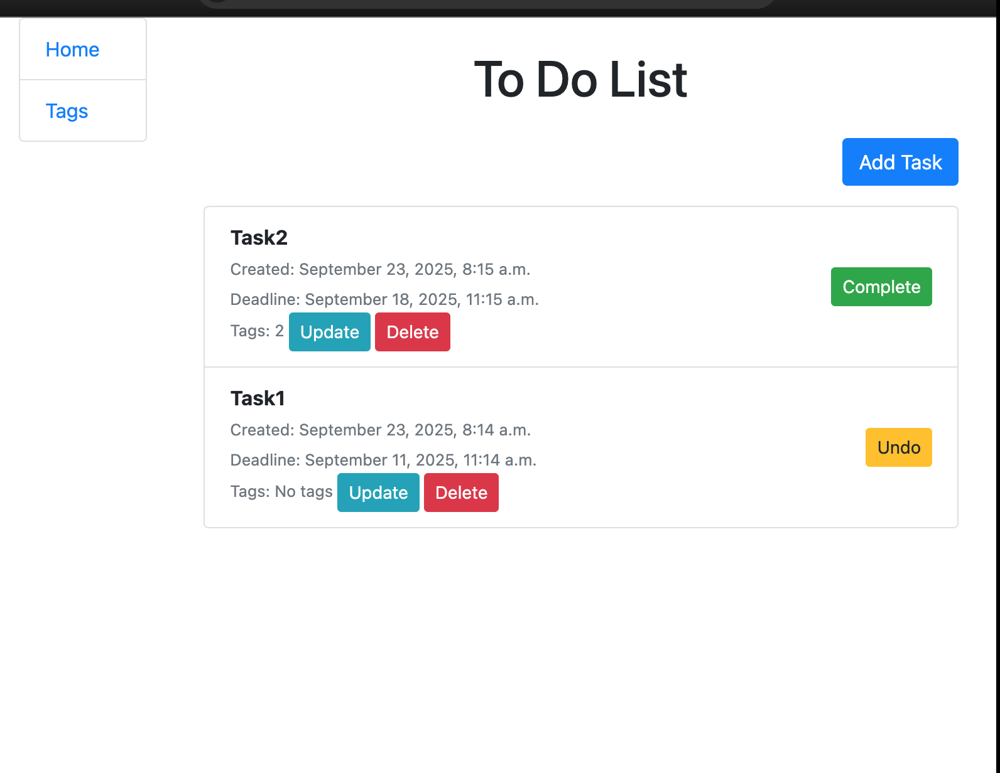

# Todo-list

Django project for managing task's

## Installation

Python3 must be already installed

```shell
git clone https://github.com/VladPh1/Todo-list
cd Todo-list
python3 -m venv venv
source venv/bin/activate
pip install -r requirements.txt
python manage.py runserver # starts Django server
```

## Features

* The ability to add topics for tasks, mark completed tasks. 
* Convenient structure for submitting tasks.

## Demo

